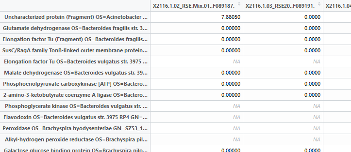
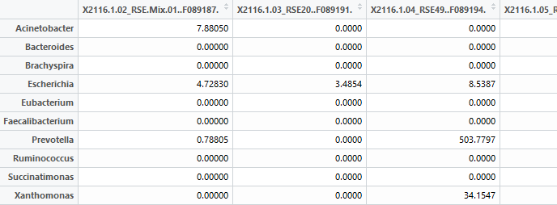

```{r setup, include=FALSE}
knitr::opts_chunk$set(echo = TRUE)
```


<br>

Before starting, remember to run all the code in the BinFunctions.R file. This will make all the Genus Binner functions available to you in R.

<br>

## Data Format

In your dataset, each row should represent a microbe and each column should represent a subject. The data can include missing (i.e., NA) values. The microbe names should be the row names (see the Reading Data into R tutorial for instructions on how to do this). Below is a screenshot of part of a dataset that includes all these criteria:



<br>

To bin our data by genus, we simply use the *binBuGenus()* function:

```{r, eval = FALSE}
binByGenus(data)
```

This results in the following:



<br>

A lot went on behind the scenes when we ran that function, so let's break down what actually happened.

Running this function will do the following:

* It will look at your data's row names and search for "OS="
* Once it finds this pattern it will extract the word after "OS=" (which is the genus)
* It will then replace the original row name with the genus
* Lastly, it will sum the columns by genus

The *binByGenus()* function also:

* Replaces any NA value with a 0
* Removes any variables (columns) with only 0s

<br>

### Search for Genus Name by Different Pattern


We can use a different pattern to search for the genus name, such as *GENUS=* (had our data contained that as an identifier for the genus) by using the *pattern* argument:

```{r, eval = FALSE}
binByGenus(data, pattern = "GENUS=")
```


Running this command will follow the same procedure as above, but it will instead extract the word following *GENUS=* in the row names.

<br>

### Prevent the Removal of Zero-Sum Columns

We can prevent the function from removing variables with only 0s, by using the *rm.zero.vars* argument:

```{r, eval = FALSE}
binByGenus(data, rm.zero.vars = FALSE)
```

This will stop the function from deleteing any variables (subjects) with all 0s. The reason it is useful to remove variables with only 0s is because you will get a non-numeric value (*NaN*) when trying to calculate the proportions if all the values in a column are 0s.

<br>

### Genus Binner Function Library

In this section, for each Genus Binner function, I will list all possible arguments and possible values of the arguments including the argument's default.

<br>

Because R does not read spaces between arguments, rather than write the functions on a single line as we have done so far, like this:


```{r, eval = FALSE}
mean(x)
```


I will expand the function across multiple lines and comment the arguments like this:

```{r, eval = FALSE}
mean(
    x    #the numbers to find the mean of
    )
```

<br>

#### Genus Binner Functions:


#### binByGenus()

```{r , eval = FALSE}
binByGenus(
    data,                    #data as described at top of this document
    pattern = "OS=",         #pattern to locate the genus by (default = "OS=")
    rm.zero.vars = TRUE      #whether to remove variables (subjects) with values of all 0s (default = TRUE)
)
```


<br>

#### Questions or comments

If you have any further questions, or comments, you can contact Matt Cook (cookm346@myumanitoba.ca).


<br>
<br>
<br>
<br>
<br>
<br>
<br>


