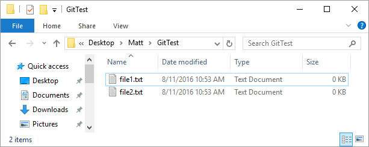

```{r setup, include=FALSE}
knitr::opts_chunk$set(echo = TRUE)
```

### What is Git?

Git is software that is used for *version contol*. Everytime you copy a file and name it something like *abstract-backup1.docx*, or *homepage-version1.html*, you are using a form of version control. You are keeping track of previous versions of a document, so that you have the option of returning to that previous version. Git allows you to easily backup different versions of your files, view differences between the files, recover previous versions of your files, and much more.

<br>

### What is GitHub?

GitHub is an online repository where users can upload files. These files can then be viewed, downloaded, and editted by other users, and then uploaded back onto GitHub.

<br>

If these short descriptions don't give you a very complete idea about what Git and GitHub are all about, that's okay. As we move through this tutorial, both Git and GitHub will make more sense.

<br>

### Downloading and installing Git

You can download Git from https://git-scm.com/downloads

After you download and install Git, open *Git Bash*:


Git Bash will be the window where we will type the commands that will allow us to save and retrieve different versions of our files. There are really only a handful of commands we will need to use.

In the screenshot above, we can see our login name for the computer we are on in green (*HIV-Proteomics*). In yellow we see the current directory we are working in. Notice in this example the working directory is the ~ symbol, which just means our computer's default directory.

<br>

### Changing our Working Directory

If we are going to be saving versions of our files with commands in this window, we will want to make it easy to access our files by name. So, the first thing we will want to do is change our current working directory to the location where our files we want to work with are saved. We can do that by typing *cd* which stands for *change directory*. We then type a space, and then the location we want to work from. For example:

```{r, eval = FALSE}
cd C:/Users/HIV-Proteomics/Desktop/Matt/GitTest
```

We have now set our working directory to the GitTest folder (You of course will set your working directory to where the files you want to work with are saved). You will notice that the yellow ~ symbol will have changed to the directory you chose.

*Note:* You need to use forward as opposed to backward slashes when specifying a location on your computer.

<br>

### Listing Files from the Command Line

I have two empty .txt files in my *GitTest* folder that I will be using for this tutorial:



<br>

You may have more (or less) files and subfolders in the folder where you are working, but the general concepts and examples in this tutorial will be the same. Let's see if we can view these files using the command line. Type the following into Git Bash:

```{r, eval = FALSE}
ls
```

*ls* means *list* files. You will see all the files and folders in your working directory. When I type the command above, I see *file1.txt* and *file2.txt*

This is a good step to make sure we are working in the folder we think we are.


<br>

### Our First Git Command


All of the Git commands we will use all start with the word *git*, which allow our computer to know we are using a command unique to Git, rather than a general command like *cd* or *ls*. The first Git command we will use is:

```{r, eval = FALSE}
git status
```

This tells us the status of our working directory. This may not mean much now, but this will be a command you will use over and over, and it will become clear why as we move through this tutorial. However, when we run this command now, we will get an error message:

```{r, eval = FALSE}
fatal: Not a git repository (or any of the parent directories): .git
```

<br>

### Tell Git to Pay Attention

The reason we get this error message is because we have not yet told Git to start watching our working directory. We need to tell Git to start watching this working directory, and to do that we can use the command:

```{r, eval = FALSE}
git init
```

*init* stands for *initialize* and starts the process of Git paying attention to our working directory:

```{r, eval = FALSE}
Initialized empty Git repository in C:/Users/HIV-Proteomics/Desktop/Matt/GitTest/.git/

```

<br>

Let's try our *git status* command again and see what happens:

```{r, eval = FALSE}
On branch master

Initial commit

Untracked files:
  (use "git add <file>..." to include in what will be committed)

        file1.txt
        file2.txt

nothing added to commit but untracked files present (use "git add" to track)
```

The key information here is that Git tells us it knows about our two files, but where has this gotten us? To understand the rest of the tutorial we need to understand Git's structure.

<br>

### The Structure of Git

Git has three main areas where files are stored. One area is our working directory, this is the folder on our computer where our files we want to work with are saved. 

Another area is our repository. We can think of this as another location on our computer we can't see, where we can save all our different versions of our files. Because we can't see this area direcly, it saves us from having our working directory filled with many different versions of the same file. We can also think of this as an external hard drive that we use to backup our files from time to time.

The last area is our staging directory. This is a kind of limbo in between our working directory and repository where files are temporarily stored before being permanately backed up in our repository.

If all of this seems confusing, don't worry, we'll clear it up with a few examples.

<br>

### Backing up our First Set of Files

Let's say we want to be safe and backup our *file1.txt* and *file2.txt* before we start making any changes to them. We could copy these files and save them with new names, such as *file1-original.txt*. But, Git allows us to keep only one version of our files in sight while still backing up our files. In Git lingo, this is called making a repository.

To make a repository, there are two steps. First, we send our files to our staging area. Next, we move the files from the staging area to our repository.

If we only want to add one file (such as *file1.txt*), we use the command:

```{r, eval = FALSE}
git add file1.txt
```

We can add multiple files by simply typing our files one after another:

```{r, eval = FALSE}
git add file1.txt file2.txt
```

Because we only have the files *file1.txt* and *file2.txt*, the command above would be identical to:

```{r, eval = FALSE}
git add .
```

The period rather than the file name means "add all the files in the working directory". This saves us from having to type out all our files.

<br>

Now that our files are in our staging area, the next step is to put them in our repository:

```{r, eval = FALSE}
git commit -m "initial commit"
```

This command looks a bit more confusing then the previous commands, so let's break it down:

We type *git* because we are using a Git command and all Git commands start with the word *git*.

*commit* means we are commiting our files from the staging area to our repository.

*-m* means we want to include a message for our commit, and the *"initial commit"* is a message I chose (though it could say anything). This way, when I look back at these set of files, I know why I chose to save them at this point. Had this been a save where I was adding a paragraph of text to file2, my commit message might be *"adding a paragraph to file2"*. These messages are little notes for yourself so if you want to return back to a particular version of your file, it is easy to do so.

<br>

This pattern of making changes, then using *git add* and *git commit* is the general workflow for using Git. Everytime we feel compelled to save a backup, we can use *git add* then *git commit* and create a new repository with our backed up files.

<br>

### Removing a File from the Staging Area

Let's say after adding *file1.txt* to the staging area, for whatever reason, we want to remove this file from the staging area. We can do so with the following command:

```{r, eval = FALSE}
git reset HEAD file1.txt
```

This command will pull *file1.txt* from the staging directory. This is helpful if you wanted to add every file to your staging area except for a couple files. You could use the *git add .* to add all the files in your working directory to the staging area. Then, you could use *git reset HEAD filename* where *filename* is the name of the file(s) you then want to remove from the staging area.

<br>


### Viewing our Log of Changes

Even though we have only made one repository, let's look at a list of our repositories by typing *git log* into Git Bash. We get the following message:

```{r, eval = FALSE}
commit f9bca2313d8ea649f11981ffcc02670a839a07e0
Author: Username <email@email.com>
Date:   Thu Aug 11 11:48:27 2016 -0500

    initial commit

```

The first line gives us a reference number for our commit. This will come in handy later if we want to get a previous version of a file from this commit.

The second and third line show who made the commit and the date the commit was made.

The final line shows the commit message we used, which in this case was "initial commit".

<br>

### Viewing Differences Between Files and Repositories

Let's suppose we make changes to our files and want to see how those files are different than what we have saved in our latest repository. We can view the differences between the files in our working directory and the files saved in our repository by using the following command:

```{r, eval = FALSE}
git diff
```

```{r, eval = FALSE}
diff --git a/file1.txt b/file1.txt
index 3855285..d03daf6 100644
--- a/file1.txt
+++ b/file1.txt
@@ -1 +1 @@
-This is file 1. This file is good.
\ No newline at end of file
+This is file 1 in this working directory. This file is good.
\ No newline at end of file
diff --git a/file2.txt b/file2.txt
index 01ecb51..dd19201 100644
--- a/file2.txt
+++ b/file2.txt
@@ -1 +1 @@
-This is file 2. This file is great.
\ No newline at end of file
+This is file 2 in this working directory. This file is great.
\ No newline at end of file

```

We can see that for each file (*file1.txt* and *file2.txt*) that changes have been made. We can't see it in this printout, but in Git Bash the red text shows the version of the file in the repository and the green text of the file in our working directory.

To make the changes easier to visualize we can color the words by adding to the command we use slightly:

```{r, eval = FALSE}
git diff --color-words
```

This will show us the differences in our files in the repository and files in our working directory, but now the red text is the text that has been deleted, and the green text is the text that has been added.

<br>

### Getting Previous Versions of Files

Let's have a quick look at our log of commits:

```{r, eval = FALSE}
commit d5c5a6f7d121b557384fdb0b65bc1905fd67b70c
Author: Username <email@email.com>
Date:   Thu Aug 11 13:39:49 2016 -0500

    modified file1

commit c090515240501d9d8d34e56ffbfa490a6f3dd227
Author: Username <email@email.com>
Date:   Thu Aug 11 13:09:36 2016 -0500

    added content to file1 and file2

commit f9bca2313d8ea649f11981ffcc02670a839a07e0
Author: Username <email@email.com>
Date:   Thu Aug 11 11:48:27 2016 -0500

    initial commit

```


Let's suppose that after a series of changes to both our files, we decide we actually want to get the version of *file1.txt* from the commit that starts with *c0905152*.

We can checkout a previous version of *file1.txt* by using the *git checkout* command:

```{r, eval = FALSE}
git checkout c0905152 -- file1.txt
```

This command takes *file1.txt* from the commit that starts with *c0905152* and puts it in our staging area. (*Note:* We could copy and paste the entire repository reference string *c090515240501d...*, but what we pasted is enough for Git to know which commit we mean).

It is important to realize that this command has done the exact same thing as if we just edited our file manually to be identical to the file from the commit *c0905152* and added that file to our staging area. We still have to decide what to do with this file, and we have two real options.

1.) We could just undo this change and get our most recent version of the file back, or 2.) we may decide we want to include this retrieved file and make a new commit to save this retrieved file with our most current commit. Let's look at both these options in turn:

<br>

#### Option 1: Undoing the Retrieval of a file

Checking out *file1.txt* from a previous commit is identical to manually editing *file1.txt* and adding it to the staging area using *git add file1.txt*. To get our most current *file1.txt* back we do two things: 1.) remove the checkout *file1.txt* from our staging area, and 2.) get our most recent *file1.txt* back.

First, we use the *git reset HEAD* command, which we have already used, to remove the file from the staging area:

```{r, eval = FALSE}
git reset HEAD file1.txt
```

Now the modified version of *file1.txt* that we pulled from a past commit is in our working directory.

We can then use the *git checkout* command to retrieve the most recent version of *file1.txt* from the most recent commit:

```{r, eval = FALSE}
git checkout -- file1.txt
```

<br>

#### Option 2: Making a New Repository with our Retrieved File

If we want to create a new repository with our retrieved previous version of *file1.txt*, we simply create a new repository using the *git commit* command, just like we did before:

```{r, eval = FALSE}
git commit -m "retrieved file1.txt from repository c0905152"
```

Now our most recent repository includes *file1.txt* from the repository with the ID *c0905152...*.

<br>

### Viewing Differences Between Staging Area and Repository

One thing you may notice when pulling a previous version of a file into your staging area is that the command *git diff* no longer seems to work. This is because the *git diff* command shows the differences between the latest repository and your working directory, but the file that is taken from a previous repository is added to your staging area.

One option is to simply more the file back to your working directory with the *git reset HEAD* command and then use *git diff*. Another (and better) option is to alter the *git diff* command by adding the *staged* argument:

```{r, eval = FALSE}
git diff --staged
```

To view the colord differences in the files, we can also add the *--color-words* argument as we did previously:

```{r, eval = FALSE}
git diff --staged --color-words
```


<br>

### Advanced Git Usage

There are many, many more features that Git has to offer, but these basic commands we have explored will let you backup your work, view differences between files, and retrieve previous versions of your files. A great resourse for for advanced use is the set of GitHub help pages: https://help.github.com/

<br>

### Pushing Files to GitHub

The final thing you will want to do is *push* your files to GitHub, which just means place your files on the GitHub website. There are two reasons you likely will choose to do this. The first reason is that you want to use your online GitHub repository to further backup and keep a record of your work. The second reason, and likely the much more common reason, is to make your work visible and accessible to others.

After making an account on GitHub, make a new online repository by clicking the *+* button on the top-right hand corner of the GitHib website. We'll call ours *Test* as an example.

Then we need to tell Git the location on GitHub where to send the files from our computer. Because we made our GitHub Repository folder called *Test*, we use the following command:

```{r, eval = FALSE}
git remote add origin https://github.com/Username/Test
```

You can see above that the location we are telling Git to push our files to is https://github.com/Username/Test. *Username* would need to be changed to your GitHub username, but other than that the command can be left unchanged.

Now that Git knows where to send the files, we can actually push the files onto GitHub using this command:

```{r, eval = FALSE}
git push
```

This will take our files from our latest Git Repository and push them to the URL above. But, the first time we want to push our files to GitHub we should use this command:

```{r, eval = FALSE}
git push -u origin master
```

After our initial commit to GitHub, we can just return back to using the *git push* command. The command above pushes the files to our GitHub repository just like the simple *git push*, but also saves our settings such as that this is the *master* or main branch.

<br>

### Downloading (Cloning) a GitHub Repository

So far we have built our own repository from scratch, but there are times when we will want to work on an already existing repository that is stored on GitHub. This may even be our own repository that we have pushed to GitHub in the last demonstration.

To do download (or *clone*, in Git lingo) a GitHub repository, we use the *git clone* command and specify the URL of the GitHub repository:

```{r, eval = FALSE}
git clone https://github.com/Username/Repo
```

For example, to download all the code and tutorials I have written (including this tutorial), we can use the following command:

```{r, eval = FALSE}
git clone https://github.com/cookm346/Bioinformatics
```

After running this command the entire Bioinformatics repository will be downloaded to your computer. You not only will have all the files available to you, but will also have the entire log of changes (you could see these series of commits by running *git log*).

<br>

### Git & GitHub Cheatsheet

```{r, eval = FALSE}

#BASIC SETUP
cd C:/YourDirectory                     #changing your directory in Git Bash
ls                                      #list files in directory


#BASIC GIT SETUP
git config --global user.name "name"    #set username
git config --global user.email "email"  #set email


#INITIALIZING YOUR WORKING DIRECTORY
git init                                #tell Git to pay attention to this directory


#STATUS AND LOG
git status                              #check status of working directory
git log                                 #get log of previous commits
git log -n 5                            #limit to five most recent commits


#VIEWING DIFFERENCES BETWEEN FILES
git diff                                #view differences between files in working directory and repository
git diff --color-words                  #color words to easier visualize differences
git diff --staged                       #view differences between files in staging area and repository


#ADDING FILES TO STAGING AREA
git add .                               #add all files in working directory to staging area
git add filename                        #add file called filename in working directory to staging area
git add f1 f2 f3                        #add three files (called f1, f2, f3) to staging area


#COMMITING FILES TO A REPOSITORY
git commit -m "message"                 #commit all files in staging area to new repository


#ADD AND COMMIT FILES IN ONE COMMAND
git commit -a -m "message"


#RETRIEVING FILE FROM PREVIOUS COMMIT
git checkout commitID -- filename       #get file (called filename) from repository with commitID (e.g.,
                                        #git checkout e73hrghe7 file1.txt)


#REMOVE FILE FROM STAGING AREA
git reset HEAD -- filename              #remove a file (called filename) from staging area


#ADD A REMOTE REPOSITORY ON GITHUB
git remote add origin https://github.com/Username/Repo


#PUSH FILES TO GITHUB
git push -u origin master               #for first push
git push                                #for all subsequent pushes (settings are now saved)


#CLONE GITHUB REPOSITORY
git clone https://github.com/Username/Repo

```


<br>

#### Questions or comments

If you have any further questions, or comments, you can contact Matt Cook (cookm346@myumanitoba.ca).


<br>
<br>
<br>
<br>
<br>
<br>
<br>
<br>
<br>
<br>


