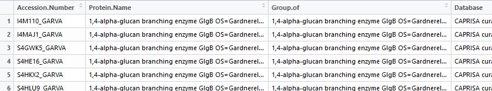
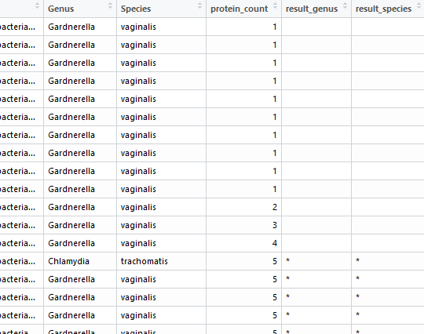

```{r setup, include=FALSE}
knitr::opts_chunk$set(echo = TRUE)
```


<br>

Before starting, remember to run all the code in the HPRFunctions.R file. This will make all the Homologous Protein Removal functions available to you in R.

<br>

## Data Format

In your dataset, there are only two required variables (though you can have more and variables can be in any order). The first is a "protein name" variable that has some pattern to identify the genus and species. For example, in the screenshot of the dataset below, the genus and species are identifiable after "OS=". This gives us some way to search for and extract the genus and species name. The second variable your dataset must contain the grouping variable. This will be the variable the function will look to see if there is ambiguity in the genus and species within each group.

Below is a screenshot of part of a dataset that includes all these criteria:



<br>

### Identifying Homologous Proteins

We can use the *HPR()* function to flag the homologous proteins by both genus and species. Let's assume we have our data in R saved as *data*. As we can see in the screenshot above, our protein variable is the second variable in our dataset, and the grouping variable is the third variable in our dataset. We'll use these two variable locations in our *HPR()* function:

```{r, eval = FALSE}
HPR(data, 2, 3)
```

The first argument is the name of our data in R, the second argument is the column number for the protein name column, and the third argument is the column number for the grouping variable.

When we run this function, we get our original dataset returned to us, but with five other variables appended to the dataset:

* Genus
* Species
* Protein Number (or Count)
* Results for Genus level
* Results for Species level

The Genus and Species variables list the Genus and Species extracted for each protein. The Protein Number (or Count) lists the unique grouping number. For example, in the screenshot below the number 1 is repeated 10 times because the first 10 rows are from the same group. The asterisks in the Genus and Species resutls columns indicate that there is ambiguity in the genus or species identified for that group. 

Here is a screenshot of part of the output from running the *HPR()* function.




<br>

### Homologous Protein Removal Function Library

In this section, for each Homologous Protein Removal function, I will list all possible arguments and possible values of the arguments including the argument's default.

<br>

Because R does not read spaces between arguments, rather than write the functions on a single line as we have done so far, like this:


```{r, eval = FALSE}
mean(x)
```


I will expand the function across multiple lines and comment the arguments like this:

```{r, eval = FALSE}
mean(
    x    #the numbers to find the mean of
    )
```

<br>

#### Homologous Protein Removal Functions:


#### HPR()

```{r , eval = FALSE}
HPR(
    data,                    #data as described at top of this document
    procol,                  #protein name column number (default = none)
    grocol,                  #grouping column number (default = none)
    pattern = "OS="          #pattern to locate the genus by (default = "OS=")

)
```


<br>

#### Questions or comments

If you have any further questions, or comments, you can contact Matt Cook (cookm346@myumanitoba.ca).


<br>
<br>
<br>
<br>
<br>
<br>
<br>


