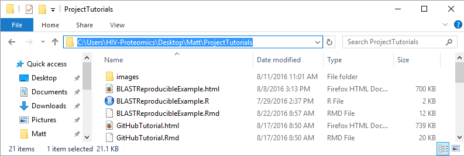
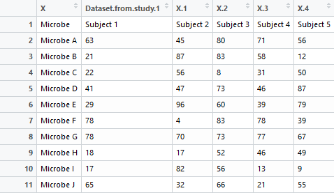
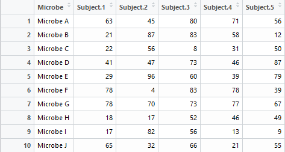
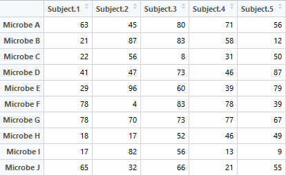

```{r setup, include=FALSE}
knitr::opts_chunk$set(echo = TRUE)
```

```{r, echo = FALSE}
data <- read.csv("ExampleData.csv", skip = 1, row.names = 1)
```


<br>

#### Working Directory

To read data into R, we need to first set our *working directory*. The working directory is the location on our computer where are files we want to read into R are saved. Setting our working directory allows us to call a file by name, such as *file1.csv* rather than have the specify the exact location of the file, such as *C:/Place/Where/The/File/Is/Saved/file1.csv*.

To view our current working directory, we can use the following command:

```{r, eval = FALSE}
getwd()
```

The *wd* stands for working directory. If the output shows us the locoation on our computer where our files we want to read into R are saved, then we don't need to do anything further. 

However, if we need to change our working directory, we can do so by running the following command:

```{r, eval = FALSE}
setwd("C:/Place/Where/The/File/Is/Saved/")
```

Notice we need to use forward slashes rather than backward slashes.

<br>

A quick way to get the exact location of our working directory is to use your computer's file explorer to go to the folder where your file is saved and copy the location. Here is a screenshot of an example from windows:



<br>

We can the paste this location into our setwd("") command. We would just need to change the backslahes used in Windows for forward slahes:

```{r, eval = FALSE}
setwd("C:/Users/HIV-Proteomics/Desktop/Matt/ProjectTutorials")
```

<br>

#### The read.csv() Function

Let's suppose we have a .csv file we want to read into R, named *ExampleData.csv*. Here is what the data looks like:

```{r, echo = FALSE}
read.csv("ExampleData.csv", header = FALSE)
```

<br>

Let's try reading this data into R using the *read.csv* function and save it to the object *data*:

```{r, eval = FALSE}
data <- read.csv("ExampleData.csv")
```

<br>

Here is what our data looks like inside of R:



<br>

Clearly, this is not what we want. For starters, we have a line in the dataset that is just some extraneous information ("Dataset from study 1") about the file and not anything we need.

Let's use the *skip* argument to get rid of the first line:

```{r, eval = FALSE}
data <- read.csv("ExampleData.csv", skip = 1)
```

<br>



<br>

As we can see, adding *skip = 1* made the *read.csv* command skip the first line. Had we had 3 lines of our data we wanted to ignore, we would have used *skip = 3*.

<br>

Notice too that our list of microbes are in the first column of our data, rather than as row names as the number 1 through 10 are now.

The easiest way to make our variable of microbe names into actual row names is by specifying we want the *read.csv* to use the *row.names* argument to tell R we want to use our first variable as our row names:

```{r, eval = FALSE}
data <- read.csv("ExampleData.csv", skip = 1, row.names = 1)
```


<br>



<br>

Had we wanted to use our third column as our row names, we would have used *row.names = 3*.

<br>

Now our data is read into R just the way we want, and is ready for further processing and analysis.

<br>

### Dealing with Missing Values

Many times there will be missing values in a dataset. To be concrete, let's generate a dataset with some missing values:

```{r}
set.seed(1) #set random number generator
data <- matrix(round(runif(60, 1, 100), 3), 10, 6)
data[7, 2] <- NA; data[7, 3] <- NA; data[9, 6] <- NA
colnames(data) <- paste("Subject", 1:6)
rownames(data) <- paste("Microbe", 1:10)
```

Let's have a look at the data the code above generated:

```{r}
data
```

As we can see, we have three missing (*NA*) values -- Subject 2 and 3 each have a missing value for Microbe 7, and Subject 6 has a missing value for Microbe 9.

<br>

#### Imputing Missing Values with 0s

There are many different ways to deal with these missing values. If we are going to calculate proportions and the only reason the value is missing is because a particular protein wasn't identified for a subject, we can impute the missing values with 0s.

The *is.na()* function in R will tell us all the values in our matrix that are missing:

```{r}
is.na(data)
```

As we can see, there are three TRUE values corresponding to the missing values of our dataset. To impute these values with a zero we simply use this command:

```{r}
data[is.na(data)] <- 0
```

This changes all the missing values in our dataset to 0s. Let's have a look:

```{r}
data
```

<br>

#### Removing Incomplete Observations


```{r, echo = FALSE}
set.seed(1) #set random number generator
data <- matrix(round(runif(60, 1, 100), 3), 10, 6)
data[7, 2] <- NA; data[7, 3] <- NA; data[9, 6] <- NA
colnames(data) <- paste("Subject", 1:6)
rownames(data) <- paste("Microbe", 1:10)
```


Another option to deal with missing values is to remove any observation (row) in a dataset that has a missing value. We can use the *complete.cases()* function to see which observations (rows) in our dataset are complete:

```{r}
data[complete.cases(data), ]
```

As we can see, microbes 7 and 9 have been removed.


<br>

#### Questions or comments

If you have any further questions, or comments, you can contact Matt Cook (cookm346@myumanitoba.ca).


<br>
<br>
<br>
<br>
<br>
<br>
<br>
<br>
<br>
<br>


